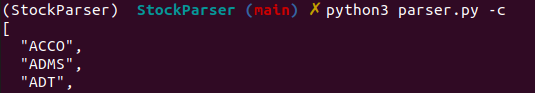
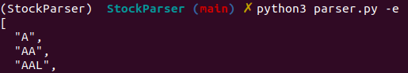
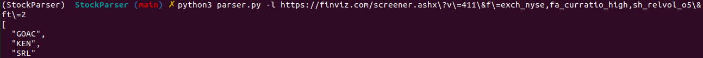
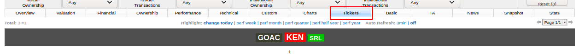

## It's just CLI ticker parser 

This script parse tickers from https://finviz.com/screener.ashx?v=411 according to your requirements and sending to stdout.

Works well with my other app - [TradingViewClient](https://github.com/Spehof/TradingViewClient)

Examples:

`python3 parser.py -e > tee tickers.txt > some another place`

## CLI args

`python3 parser.py -h` or `python3 parser.py --help` 

`python3 parser.py -c` or `python3 parser.py --cheap` for parsing chares under 10$ with my preset params.

`python3 parser.py -e` or `python3 parser.py -expensive` for parsing chares over 10$ with my preset params.

### Also you can set you own params.

1. Go to https://finviz.com/screener.ashx?v=411 and set anything you want params.
2. Copy link. 

For example:
`https://finviz.com/screener.ashx?v=411&f=an_recom_holdbetter,geo_usa,sh_price_u40,sh_short_u5,ta_averagetruerange_o1.5,ta_sma200_pb&ft=3`

3. Set this link with `-l` params.

`python3 parser.py -l https://finviz.com/screener.ashx?v=411&f=an_recom_holdbetter,geo_usa,sh_price_u40,sh_short_u5,ta_averagetruerange_o1.5,ta_sma200_pb&ft=3`

4. Enjoy!    

#### Remember! For now need link from tab tickers

## Attention!

If you will be use this script with my preset params `-c` or `-e` you can get some trouble. I use params `current value: over 300k` and if start parsing before exchange will be open (maybe 1-2 hours before opening) you can will see, that the script will not find any stock. It happens because param "current value" was be already renewal to current day (and became zero for today)!

## Installation

1. `mkdir ~/StockParser`

2. `git clone https://github.com/Spehof/SharesParser ~/StockParser`

3. `python3 -m venv ~/StockParser`

4. `source ~/StockParser/bin/activate`

5. `cd ~/StockParser`

6. `pip3 install -r requirements.txt`

7. `python3 parser.py -c`

